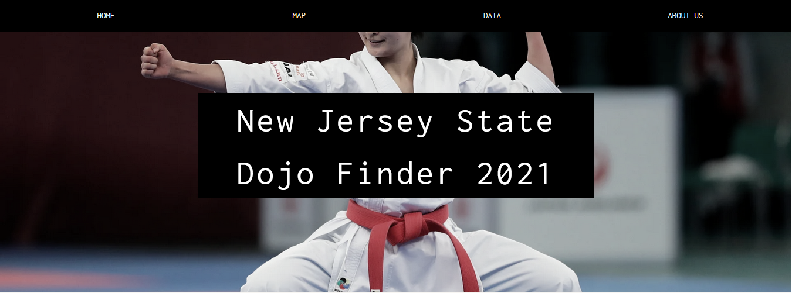

# Dojo-Finder

## Background

---
There may be a lot of important and useful data available regarding Martial Arts these days, but it is often dispersed among multiple data sources and not well organized. Extracting the data from its sources, transforming it by cleaning or reformatting it, and loading or storing the resulting data into a well designed database is a critical process for data-driven organizations.

Presenting the associated data visualizations in a well defined and organized website for users who are looking for a nearby Dojo makes this process even more meaningful and effective.

## Mission

---

To provide users with a data source that will help identify and locate a Martial Arts dojo that best meets their needs.

The focus for our first website version is limited to the state of New Jersey, with the potential that future versions can expand to more states within the United States as desired.

## Let's Get Started

---

Do you want to learn how to fight and defend yourself but don’t know where to start? - you've come to the right place!!

As the purpose of these efforts is to create an application for users to find a Martial Arts school near them, or at a preferred location, this site will help unlock the secret "code" of Martial Arts for both beginners and continuing Martial Arts students.

For those looking to learn more about the different styles and types of Martial Arts available in search of dojos to support their interests, just navigate to our "Sunburst" of knowledge on the "Home" page. This visual tool will provide the user with more info on the various techniques such as Strikes (punching, kicking),  Grappling (throwing, pinning), Hybrid, etc, with the option to further refine browsing with more subtopics and descriptions of each Martial Arts type as selected by the user.  

The user can also just jump right in by searching with their preferred location details to determine the nearest or desired Dojo. The search result will take them to the "Map" Page for them to visually confirm or further refine their search results.

The "Data" Page also hosts the compilation of Dojos in New Jersey with its respective details so the user can choose another method to filter the data requested.

## Technology

---

* Javascript/HTML/CSS
* Python
* Flask
* Beautifulsoup
* MongoDB
* Pandas
* Splinter
* Leaflet/Sunburst add on

## Datascraping

---

Data Scraped from a Martial Art Dojo and informational websites to gather all relevant data

Utilizing Pandas, Beautifulsoup and Splinter, the code will pull the following information:

* Name of the Dojo
* Phone Number
* Zipcode
* Street Address
* City
* State
* Styles that the dojo teaches
* County

The pulled data is placed into a dictionary which will be append to the `dojo_list` list. Once the list of dictionaries is created, the dictionary is used to create the dataframe.

## Data Cleaning

---

The dataframe is then cleaned before we use the Google API and being sent to a MongoDB database.

Some of the entries are missing values or have invalid cells(i.e. e-mail addresses in the street address cell). With this cleaned database, the next step is to use the Google API.

The url is created with the street address, city, state and api_key. The API urls are then placed in a list that requires a "for loop." The latitude and longitude are then appended to each dictionary. The updated list of dictionaries are then uploaded into another dataframe.

There are cases that the Geocode does not have results. As such the latitude are then marked as `""` or empty. This is then later removed.

The new dataframe is then saved as a json file. This json file can then be used to create the MongoDB on a local machine.

## Load

---

Extracted and transformed the data for use into a  MongoDB database with the scalability and flexibility needed, i.e. many Martial Arts schools host multiple sytles of Martial Arts across the board so MongoDB supports that data.

This code is the same as the code in mongosetup.py

## Webpages

---

HTML/CSS utilized to create the front-end pages to display the data and info in a user friendly view.

Using javascript's sunburst plugin, the information was displayed in an intereactive manner.

Javascript's sessionStorage was used as a new tool to further our efforts. Main functionality is to save any form information. This is then used for the leaflet map to focus in on.

Leaflet options leveraged for mapping purposes to identify the location and Dojo details (tooltips) within New Jersey.

Markers are added to each dojo showing the name, phone number, address and the county along with the state.

## Heroku

---

The app was deployed to Heroku. To look at the app use the this [link](https://dojo-finder.herokuapp.com/). If Heroku is unavailable then please make sure to run `mongosetup.py` followed by `app.py`. This will allow you to run the app on the local machine. You will also need an api key for mapbox.

## Future Versions

---

As we look to continuously improve, our future versions may seek to:

1. Link the New Jersey Counties dropdown on the current "Home" Page to more defined location on the "Map" Page.
2. Refine our County search or filter options on the website's "Data" Page in a more advanced manner.
3. Continuously take in feedback and update our website based on suggestions from our users.
4. Update the "sunburst" of knowledge tool to adapt to popular styles in states outside of NJ as other states are added in.
5. Having the map look less cluttered.

Stay tuned!!

## Team Members

---

* Ben Kramskoi - Programmer/ Analyst
* Kevin Lam - Programmer/ Analyst
* Nehemiah Burney-Porter - Programmer/ Analyst
* Buddy Slater - Programmer/ Analyst
* Jessy Thomas - Programmer/ Analyst

